

  

<h1 align="center">Hi 👋, I'm Adil Khan (aka FanoyG)</h1>
<h3 align="center">🛡️ SOC Analyst in Progress | Blue Team & Defensive Security | India 🇮🇳</h3>

  
  
  
  

---

## 📌 About Me

I’m a **hands-on cybersecurity learner** building practical, SOC-ready skills through real-world labs, defensive security projects, and structured blue-team challenges.

My journey started with:
- Python automation  
- Cloud & AWS exploration  
- DevOps fundamentals  

But everything led me to my real passion → **Cybersecurity & Blue Teaming**.

Right now, I’m focused on becoming a **Tier-1 SOC Analyst**, strengthening:
- Windows Event Log & Sysmon analysis  
- Network fundamentals & packet understanding  
- SOC investigation workflows  
- Incident-style lab projects

---

## 🏅 Badges & Learning Progress
1. **🛡️ LetsDefend SOC Analyst Badges**
<table align="center" border="0" cellpadding="15" cellspacing="0" style="border: none;">
<tr>
<td align="center">
<a href="https://app.letsdefend.io/my-rewards/detail/8ef15c57-36f9-4b78-8d13-5923136055b5">
 
</a>
<b>Cybersecurity Student</b>
</td>
<td align="center">
<a href="https://app.letsdefend.io/my-rewards/detail/cc0b47a9-467f-4eae-aef9-e6371ae70d7a">
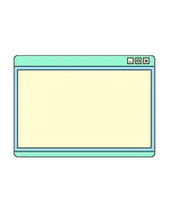 
</a>
<b>Windows 101</b>
</td>
<td align="center">
<a href="https://app.letsdefend.io/my-rewards/detail/7f1f3701-78d6-466a-8c33-14f8610cf68f">
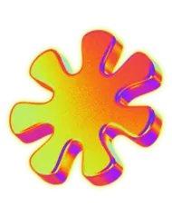 
</a>
<b>Linux 101</b>
</td>
<td align="center">
<a href="https://app.letsdefend.io/my-rewards/detail/e27fa32c-c285-4667-b520-e30ccf2dc4e4">
 
</a>
<b>Network Fundamentals</b>
</td>
</tr>
<tr>
<td align="center">
<a href="https://app.letsdefend.io/my-rewards/detail/2a165902-25aa-49ee-bfd3-c5a6b7257881">
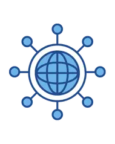 
</a>
<b>Network Fundamentals 2</b>
</td>
<td align="center">
<a href="https://app.letsdefend.io/my-rewards/detail/dd5bdd2d-b7ce-4e99-9f16-aaf56e2cc154">
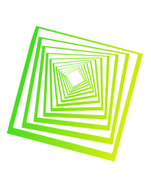 
</a>
<b>Network Protocols</b>
</td>
<td align="center">
<a href="https://app.letsdefend.io/my-rewards/detail/9b7ba9cc-bf78-4f14-80a4-2176d30956d3">
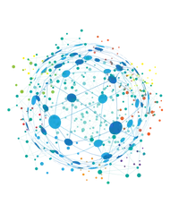 
</a>
<b>Network Protocols 2</b>
</td>
<td align="center">
<a href="https://app.letsdefend.io/my-rewards/detail/b11545ec-6945-47ef-a425-caf1e1fc1df3">
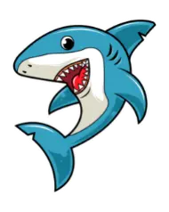 
</a>
<b>Wireshark Expert</b>
</td>
</tr>
<tr>
<td align="center">
<a href="https://app.letsdefend.io/my-rewards/detail/8ae666bf-1570-44e1-bdf6-9d62a7d12083">
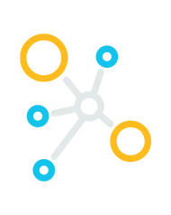 
</a>
<b>Network Analyzer</b>
</td>
<td align="center">
<a href="https://app.letsdefend.io/my-rewards/detail/8e20baa2-0f3a-466a-b9c3-a886d19d6ecd">
 
</a>
<b>SIEM Investigation</b>
</td>
<td align="center">
<a href="https://app.letsdefend.io/my-rewards/detail/fd9c08f4-42d5-498c-9a88-c0e830001fda">
 
</a>
<b>1st Alert Solved</b>
</td>
<td align="center">
<a href="https://app.letsdefend.io/my-rewards/detail/5dd01a15-1589-45b4-b6fb-e63e218ff281">
 
</a>
<b>5 Alerts Master</b>
</td>
</tr>
<tr>
<td align="center">
<a href="https://app.letsdefend.io/my-rewards/detail/529c1377-b357-4786-871b-23ab6ba4f1e7">
 
</a>
<b>MITRE ATT&CK</b>
</td>
<td align="center">
<a href="https://app.letsdefend.io/my-rewards/detail/606c21a6-6aa6-4427-be9d-4fa038014b82">
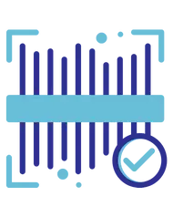 
</a>
<b>Port Scan Detection</b>
</td>
<td align="center">
<a href="https://app.letsdefend.io/my-rewards/detail/272d46dd-9a92-4fc2-982a-f3e89b846614">
 
</a>
<b>Shellshock Vuln</b>
</td>
<td align="center">
<a href="https://app.letsdefend.io/my-rewards/detail/43aea89d-447e-4318-93a3-18a3121a3b8c">
 
</a>
<b>Malware Analyst</b>
</td>
</tr>
<tr>
<td align="center">
<a href="https://app.letsdefend.io/my-rewards/detail/c592e280-23ff-4d88-a933-54412010f6b8">
 
</a>
<b>Malicious Docs</b>
</td>
<td align="center">
<a href="https://app.letsdefend.io/my-rewards/detail/52b148ae-2c0b-4dbe-96b3-47757258cf2a">
 
</a>
<b>Cryptographer</b>
</td>
<td align="center">
<a href="https://app.letsdefend.io/my-rewards/detail/2cec784d-043a-4d01-b54f-f3e9fd129251">
 
</a>
<b>VBA Macro Expert</b>
</td>
<td align="center">
<a href="https://app.letsdefend.io/my-rewards/detail/b8b36d7b-e3ab-455f-b811-710e1b893b2a">
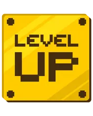 
</a>
<b>XLS Malware Detector</b>
</td>
</tr>
<tr>
<td align="center">
<a href="https://app.letsdefend.io/my-rewards/detail/93e6f3e9-2f32-4ee5-87aa-fa8513ee8109">
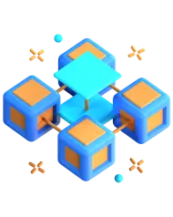 
</a>
<b>Cyber Kill Chain</b>
</td>
<td colspan="3"></td>
</tr>
</table>

2. **☁️ AWS Cloud Badges**
<table align="center" border="0" cellpadding="20" cellspacing="0" style="border: none;">
<tr>
<td align="center">
<a href="https://www.credly.com/badges/1e120bfa-b256-4c9c-b669-f1b728f8b436/public_url">
 
</a>
<b>AWS Security Fundamentals</b>
</td>
<td align="center">
<a href="https://www.credly.com/badges/232e5ee0-253d-4e00-a91d-685e80e63e65/public_url">
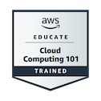 
</a>
<b>AWS Cloud 101</b>
</td>
</tr>
</table>
---

## 🛡️ Current Cybersecurity Focus

**Building Real Skills In**
- Windows Security & Telemetry  
- Sysmon + Event Logs  
- Elastic Stack (SIEM)  
- Networking for Security  
- SOC investigations  
- Attack → Detect → Respond mindset  

---

## 📚 Featured Work & Security Projects

### 🛡️ Cybersecurity (Primary Focus)

✔️ **Windows Security Telemetry + Elastic SIEM Pipeline**  
✔️ **Malware Analysis Lab (FlareVM + Remnux + INetSim)**  
✔️ **SOC-Style Investigation Labs & Case Studies**  
✔️ **Hands-on Detection & Response Documentation**

🔗 **Detailed project documentation (public):**
- 🌐 Website (Learning & Labs Hub)  
  👉 https://fanoyg.github.io  

- 📝 Notion Security Portfolio  
  👉 https://www.notion.so *(Replace with your actual Notion public link when ready)*

> All projects include: architecture, troubleshooting, investigations, screenshots & SOC relevance.

---

## ⚙️ Past Tech Exploration (Helps Me in Security)

- Python scripting
- REST APIs
- AWS & Terraform fundamentals
- Linux usage
- Backend learning experiments

These give me **engineering thinking + automation mindset** in security.

---

## 📊 GitHub Stats

  
   
  
   
  

---

## 🤝 Let’s Connect

Open to:
- Cybersecurity internships  
- SOC Analyst trainee roles  
- Collaboration on security projects  
- Learning with the community  

📧 Email: **adilkhan601782@gmail.com**  
🔗 LinkedIn: **https://www.linkedin.com/in/adil-khan5/**  

---

✨ Doing > Reading. Breaking → Fixing → Understanding. This journey has just begun. ✨

